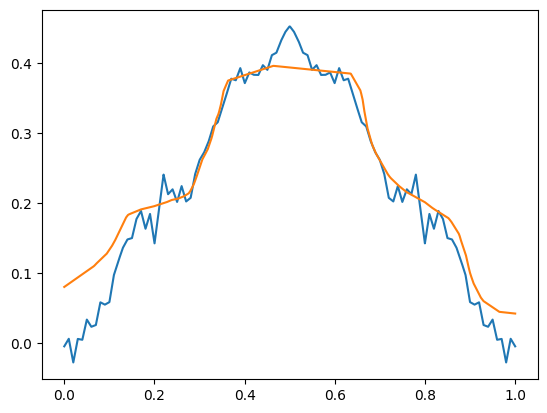

## what can MLPs learn

i want to test if and what kind of abstractions are learnable by multi layer perceptron with standart activation function

### learning abstrations

one of the simplest abstractions is mirror symmetry

lets try to predict x from y. goal is to mask a part around x = 0.2 ± 0.05 and make the network learn to fill it in based on the mirror symmetry. This would demonstrate internal abstraction.

