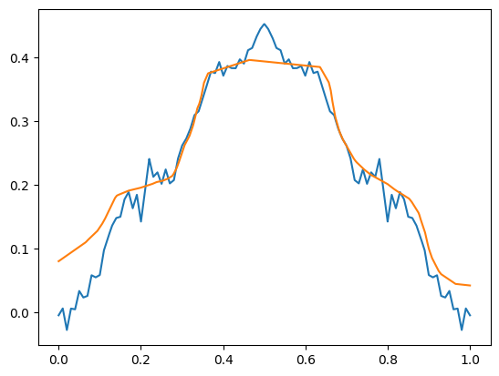
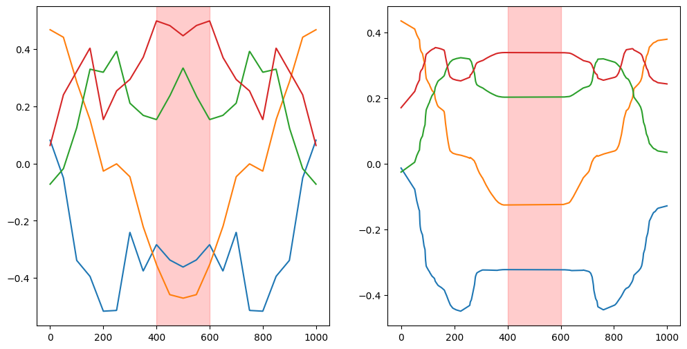
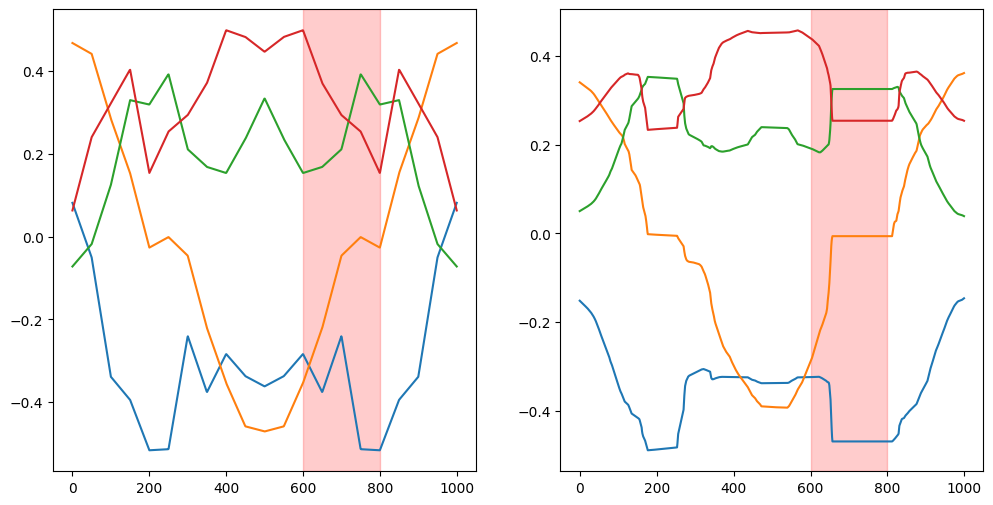

## MLP abstraction learning

memorising versus understanding the training data

I want to test if and what kind of abstractions are learnable by multi layer perceptron with standart activation function

### learning abstrations

one of the simplest abstractions is mirror symmetry

in the following we will try to demonstrate abstraction understanding by a multi layer perceptron

### masked training objective

We will train with masking to different parts of the training data. First masking around the symmetry axis and then masking beside the symmetry axis.

Is better performance at the second task a sign of understanding symmetry?